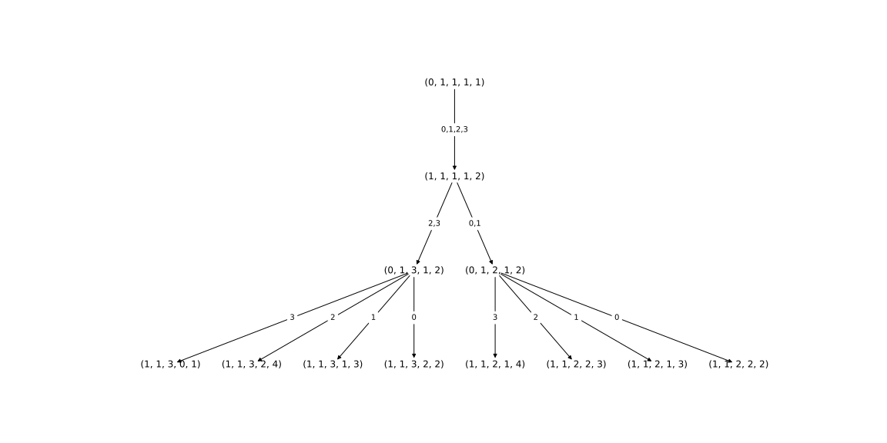
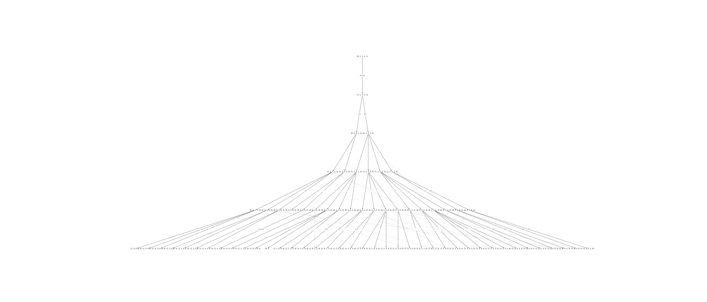

## Sticks Game

### Description
The goal of this project was to investigate a two-player game called Sticks.
In particular, I was interested in the complexity of the game tree and whether I could draw
conclusions about the actions that inevitably lead to either a win or a loss.

### Rules
- two players start with one stick in each hand
- on each turn, a player points at the one of other player's hand
- the other player's sticks in that hand update to the sum of sticks already present in
  that hand and the number of sticks in hand the player pointed with
- if other player has five or more sticks in a hand, it is taken out of the game
- during their turn, if a player only has one hand in the game and the other hand has an
  even the number of sticks, instead of pointing at the other player's hand, they have an option
  to split the sticks in that hand between two hands
- the game ends when a player has no sticks left

### State
The game state can be represented as a tuple with five integers
- the number of the player
- two numbers representing the number of sticks in each hand of the first player
- two numbers representing the number of sticks in each hand of the second player

For example, the initial state is (0, 1, 1, 1, 1), and after either action by player 0, the
next state is (1, 1, 1, 1, 2). Notice that to reduce the number of states, we can always
write the number of sticks in a player's hand in ascending order.

The total number of states then is

^2=450)

although some of them are going to be unreachable. In fact, my experiments show that
there are 306 reachable states.


### Actions

```python
ACTIONS = {
  0: (0, 0),
  1: (0, 1),
  2: (1, 0),
  3: (1, 1),
  # 4: split
}
```

Actions 0, 1, 2, 3 correspond to (0, 0), (0, 1), (1, 0), (1, 1), respectively, where
the first number represents the hand used to point with and the second number represents the
hand pointed at. Action 4 corresponds with splitting an even number of sticks between
two hands.

### Summary

This project was great for practicing my understanding of recursion and game trees.
I was also able to experiment with network visualizations using [networkx](https://networkx.org/) package for
the first time.

Unfortunately, networkx did not allow me to visualize the entire game tree.
I hope to find a better-suited tool for this purpose in the future.
I am also hoping to investigate the game with some of the reinforcement learning
algorithms I have recently learned.


